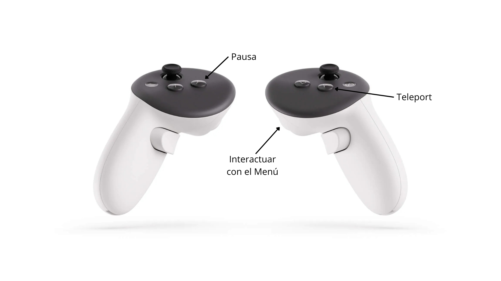

# Sujeto de pruebas RV

Experiencia de realidad virtual tipo *escape room* desarrollada en **Unreal Engine 5.5.4** (proyecto C++) para **Meta Quest 3**, usando el plugin **Meta XR**.

---

## Documentación del proyecto

### Descripción de la experiencia

El jugador se encuentra en un entorno virtual cerrado y debe **superar un minijuego de "Simon dice"** para **desbloquear el final** de la experiencia. La interacción está pensada para aprovechar las capacidades del dispositivo: el jugador se desplaza por la sala mediante **teleport** (la locomoción recomendada para VR, que minimiza el mareo) y pulsa los botones del minijuego **tocándolos físicamente con las manos**, con respuesta visual (luz emisiva) y sonora (un tono distinto por botón).

La experiencia incluye un **menú principal** (empezar / salir), **pausa** y **game over**, todos resueltos como UI en *world-space* (paneles flotantes en el mundo 3D, ya que la UI plana de pantalla no funciona en VR).

El bucle de juego es el clásico de Simon dice: el sistema muestra una secuencia de colores (luz + sonido) que el jugador debe repetir en el mismo orden. Cada ronda la secuencia crece. Al **fallar**, la secuencia se reinicia desde cero; al **completar el número de rondas requerido** (mínimo 5), se dispara la **victoria** y se desbloquea el final.

### Cómo jugar / Controles

Resumen de controles:

| Acción | Cómo se hace |
| --- | --- |
| **Desplazarse (teleport)** | Mantén pulsado el botón de teleport del mando derecho para apuntar (aparece un arco curvo y un marcador en el suelo); **suelta** para teletransportarte al destino válido. |
| **Pulsar botones del Simon** | **Acerca la mano** físicamente al botón hasta tocarlo. |
| **Interactuar con menús (UI)** | **Apunta** con el láser del mando al botón del menú y pulsa el **gatillo** para confirmar. |
| **Pausa** | Pulsa el **botón de menú** del mando para pausar / reanudar. |

### Licencias de terceros usadas

**Sonidos**

- Simon dice, sonidos para cada botón: <https://freesound.org/people/Timbre/sounds/171398/> — licencia [Attribution-NonCommercial 4.0 International](https://creativecommons.org/licenses/by-nc/4.0/)
- Sonido de error: <https://freesound.org/people/fisch12345/sounds/325113/> — licencia [CC0 1.0 Universal](https://creativecommons.org/publicdomain/zero/1.0/)

**Otros recursos**

- Assets de inicio (*Starter Content*) y *Engine Content* proporcionados por Epic Games con Unreal Engine, usados bajo la [Unreal Engine EULA](https://www.unrealengine.com/eula).

---

## Entrevista

### Qué se ha hecho

- **Framework de juego (C++).** Dos *GameModes* (`AMenuGameMode` para el menú y `AMainGameMode` para el nivel de juego), un `URVGameInstance` para estado persistente entre niveles, y una **máquina de estados** interna (`ERVGameState`: *Playing / Paused / GameOver / Win*) que centraliza las transiciones del juego.
- **Pawn de VR (`ARVPawn`).** Origen de tracking a nivel de suelo, cámara ligada al HMD y dos *motion controllers* con visualización del dispositivo en uso.
- **Entrada con Enhanced Input.** *Input Actions* y *Mapping Context* como assets, enlazados desde C++ (`UEnhancedInputComponent`), con acciones para teleport, menú/pausa y selección de UI.
- **Locomoción por teleport.** Arco parabólico con `PredictProjectilePath`, validación del destino contra el **NavMesh**, marcador de aterrizaje, visualización del arco con **Spline + Spline Mesh** y material emisivo, fundido a negro y corrección del desfase cabeza–origen al aterrizar.
- **UI en VR (world-space).** Menú principal, pausa y game over como paneles flotantes (`UWidgetComponent`) con interacción mediante **puntero láser** (`UWidgetInteractionComponent`). Los paneles se reposicionan delante del jugador al mostrarse.
- **Minijuego "Simon dice".** Botones (`ASimonButton`) con material emisivo dinámico y sonido propio; detección de toque por *overlap*; gestor (`ASimonGame`) con su propia máquina de estados, secuencia que crece por rondas, reproducción no bloqueante mediante *timers* encadenados, validación de la repetición del jugador, reinicio al fallar y **victoria** que desbloquea el final.
- **Audio (SFX).** Sonido espacializado por botón (un tono distinto cada uno), y sonido de error cuando se falla en la combinancion de colores.

### Problemas encontrados

- **Meta XR Simulator no arrancaba** ("Installation fail" sin mensaje), y una vez arrancado, **la imagen salía completamente en blanco**.
- **El teleport nunca validaba un destino**: la función de ejecución siempre entraba en el *early return* porque el punto de impacto se consideraba inválido.
- **El arco del teleport tapaba toda la vista y congelaba la cámara** al activarlo; y, ya resuelto eso, **el arco se renderizaba sin material** (gris cuadriculado).
- **El panel de pausa no se veía la primera vez** que se activaba (aparecía en blanco), pero sí a partir de la segunda.
- **El jugador no reaparecía en el `PlayerStart`** al recargar o cambiar de nivel, quedando descolocado respecto a la primera entrada.

### Cómo se han resuelto

- **Simulador.** El "Installation fail" se debía a la version del plugin Meta XR, instalando una version anterior se soluciono el problema. La **pantalla en blanco** era por no ejecutar el juego en VR preview.
- **Teleport.** Faltaban dos cosas: generar el **NavMesh** (colocar un *Nav Mesh Bounds Volume* que cubriera el suelo) y, sobre todo, **ignorar el propio Pawn en el trazado** (`ActorsToIgnore.Add(this)`); sin ello, el arco colisionaba con la propia mano del jugador y "moría" a la altura del mando, fuera de cualquier zona navegable.
- **Visualización del arco.** El tubo gigante se debía a que `SplineMeshWidth` es un **multiplicador** sobre una malla de ~1 m: se ajustó de `4.0` a `~0.03`. El material gris se solucionó activando la *usage flag* **"Used with Spline Meshes"** en el material (sin ella, el motor descarta el material en *spline meshes* y usa el de defecto). Los tirones del arco al mover la mano se corrigieron con desactivando momentaneamente el **late update** de la mano derecha.
- **Panel de pausa en blanco.** El *Widget Component* pinta su contenido en su *tick*, pero al pausar el juego en el mismo frame ese primer pintado no llegaba a ocurrir. Se habilitó **`bTickEvenWhenPaused`** en el componente.
- **Reposicionamiento al cambiar de nivel.** En VR el sistema conserva la pose física del jugador entre cargas, por lo que el Pawn quedaba desplazado respecto al `PlayerStart`. Se **recentra el tracking** en el `BeginPlay` del Pawn para alinear la cabeza con el origen del actor.

### Siguientes pasos

Con más tiempo, mejoraría la experiencia en estos aspectos:

- **Hand tracking como método de entrada.** Actualmente la interacción es por toque con los *motion controllers*; añadiría seguimiento de manos real (OpenXR Hand Tracking) con detección de gestos (*pinch* / *poke*) para pulsar botones y navegar menús sin mandos, aprovechando aún más el dispositivo.
- **Más minijuegos.** El escape room está pensado para varios minijuegos encadenados; ampliaría la sala con al menos uno más y un desbloqueo progresivo del final.
- **VFX y pulido audiovisual.** Añadiría efectos de partículas en aciertos/victoria, *feedback* háptico en los mandos al tocar botones, música ambiental de fondo y una transición más cuidada al desbloquear el final.
- **Final de la experiencia más elaborado.** Sustituir el desbloqueo actual por una secuencia con más presencia (apertura de puerta animada, cambio de iluminación, sonido de logro) que recompense mejor al jugador.
- **Accesibilidad y ergonomía.** Ajuste de la altura y distancia de los botones y paneles según la estatura del jugador, y opciones de confort (intensidad del fundido, tamaño del arco).
